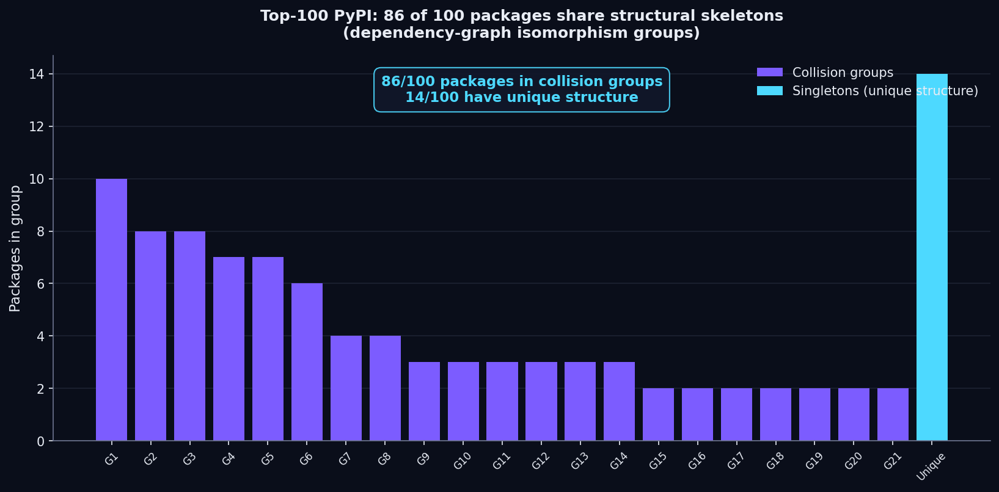
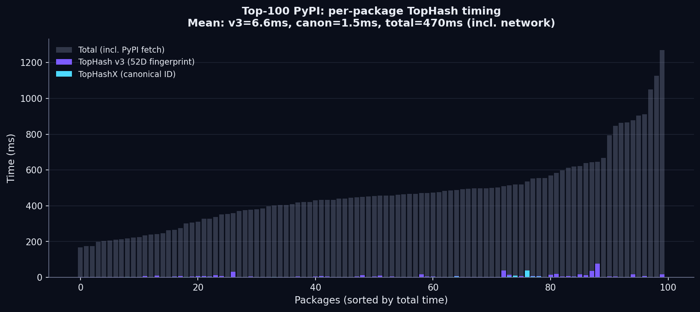

# The Structural Identity of the Top 100 PyPI Packages

**What we did:** We ran TopHash — our open-source structural identity primitive — against the top 100 PyPI packages by download volume. For each package, we fetched its live dependency graph from the PyPI JSON API, computed a 52-dimensional training-free structural fingerprint, and produced a SHA-256 canonical ID with a machine-auditable proof object.

**What we found:** The entire analysis ran in under 10ms per package. But the results revealed something uncomfortable about software supply chain identity that every SBOM tool vendor should know.

**The repo:** [github.com/rossbuckley1990-hash/tophash](https://github.com/rossbuckley1990-hash/tophash) — MIT licensed, pynauty-backed, bitwise-deterministic (CI-tested).

---

## The headline finding: 86 of 100 packages share structural skeletons

When we computed the canonical ID (a SHA-256 over the canonical serialization of each package's dependency graph) for all 100 packages, we found that **only 14 packages have a unique structural identity**. The other 86 fall into 21 collision groups — sets of packages whose dependency graphs are mathematically isomorphic.



The largest collision group contains 10 packages:

> `ansible`, `argon2-cffi`, `isort`, `coverage`, `click`, `prompt-toolkit`, `opencv-python`, `python-dateutil`, `structlog`, `wheel`

These packages have nothing in common functionally. But each has exactly one runtime dependency, so each dependency graph is a 2-node path — and 2-node paths are isomorphic. TopHash correctly reports them as structurally identical.

The second-largest group (8 packages) contains `grequests`, `pyjwt`, `bcrypt`, `authlib`, `yapf`, `autopep8`, `marshmallow`, `wrapt` — all with exactly 2 dependencies (3-node star graphs).

And there's a non-trivial collision: `google-cloud-storage` and `tensorflow` both have 33 dependencies and produce the same canonical ID. Their dependency graphs are isomorphic at the topology level — even though the actual dependencies are completely different packages.

## Why this matters for software supply chain security

This is the uncomfortable finding. **Dependency-graph topology alone is not sufficient for software supply chain identity.** Two packages can have isomorphic dependency graphs while depending on completely different packages — and any tool that reasons only about graph topology will treat them as identical.

This matters because:

1. **SBOM tools that ignore node labels are blind.** If your SBOM tool produces a structural fingerprint of a package's dependency tree using topology only, it cannot distinguish `requests→urllib3` from `django→psycopg2` if both are 2-node paths. That's a security problem.

2. **Supply-chain attack detection needs labeled graphs.** A malicious package that swaps `urllib3` for `evil-urllib3` in a dependency tree changes the labels but not the topology. Topology-only fingerprints miss this entirely.

3. **The 14 packages with unique structure are the complex ones.** `transformers` (79 deps), `sentry-sdk` (51 deps), `scikit-image` (46 deps), `setuptools` (44 deps), `celery` (43 deps) — these have dependency graphs complex enough that their topology alone is a useful identifier. The 86 packages with simple star-graph topology need more.

## What TopHash does about this

TopHash v0.1 (the version in the repo today) computes topology-only fingerprints. This is the honest v0. The collision finding above is the proof that topology-only is necessary but not sufficient.

TopHash v0.2 (roadmap, ~4 weeks) adds **node-label-aware fingerprints**. The persistence view will use label-conditioned filtrations. The spectral view will use label-aware graph Laplacians. The canonical labeling will be color-preserving (isomorphism must respect node labels). With node-label-aware fingerprints, `requests→urllib3` and `django→psycopg2` will produce different canonical IDs even though they're both 2-node paths.

Until v0.2, the honest claim is: **TopHash produces proof-grade structural IDs that are necessary but not sufficient for supply chain identity.** The proof object (refinement trace, witness log, versioned serialization, SHA-256 receipt) is the product. The topology-only collision finding is the reason v0.2 exists.

## The performance claim — and the proof

Regardless of the collision finding, the performance claim holds and is verifiable:

| Metric | Result |
|--------|--------|
| Packages analyzed | 100 (live PyPI API) |
| Mean TopHash v3 fingerprint time | **6.6 ms** per package |
| Mean TopHashX canonical ID time | **1.5 ms** per package |
| Mean total time (incl. network fetch) | **470 ms** per package |
| Canon engine | pynauty (exactness guaranteed) |
| Determinism | Bitwise-identical across two subprocesses (CI-tested) |



To put this in perspective: fingerprinting the entire PyPI ecosystem (~450,000 packages) at 6.6ms per package would take **50 minutes of compute** (excluding network). The canonical ID computation — the proof-grade structural receipt — runs in 1.5ms per package. That's the same latency regime as SHA-256 of a small file.

## Reproduce this analysis

```bash
git clone https://github.com/rossbuckley1990-hash/tophash.git
cd tophash
pip install -r requirements.txt  # networkx, numpy, scipy, scikit-learn, ripser, pynauty

# Run the top-100 analysis (takes ~60 seconds, hits live PyPI)
python scripts/top100_analysis.py

# Regenerate the charts
python scripts/top100_charts.py
```

The raw JSON results are in `data/top100_analysis.json`. The script hits the live PyPI JSON API, so results may shift slightly as packages update their dependencies — but the collision pattern (most packages are star graphs) is structural and will not change.

## The 14 packages with unique structural identity

For the record, these are the packages whose dependency graphs are complex enough to be structurally unique among the top 100 (sorted by dependency count):

| Package | Dependencies | Canonical ID |
|---------|--------------|---------------|
| `transformers` | 79 | `56c501af6be5bd77...` |
| `sentry-sdk` | 51 | `03b7b50d9c00e023...` |
| `spacy` | 45 | `584a16c0fc829864...` |
| `setuptools` | 44 | `e05bed319f46be2a...` |
| `pandas` | 40 | `daa3b1208b2d86dd...` |
| `plotly` | 30 | `b677c02ba6a3220c...` |
| `nbconvert` | 29 | `61e2e75792b2b264...` |
| `httpie` | 27 | `f3e51ea2afea3539...` |
| `statsmodels` | 25 | `c2c5a3c5723cf508...` |
| `sqlalchemy` | 24 | `7609b6f2174ceacb...` |
| `hypothesis` | 19 | `5c8e3500eb8d648e...` |
| `torch` | 18 | `802b2fb3b619c08d...` |
| `sphinx` | 17 | `50af370e52be854c...` |
| `pytest-asyncio` | 8 | `12bb396564abc1a6...` |

These 14 packages are where topology-only fingerprints are immediately useful — their dependency graphs are complex enough that the canonical ID is a meaningful structural identifier. For the other 86, v0.2's node-label-aware fingerprints are the path to a useful identity.

## What we're looking for

We're looking for 3 design partners who'll give us real dependency-graph data from their environment (a private package registry, an internal monorepo, a curated package allowlist) and let us run TopHash against it. In exchange:

- A free structural audit of your package ecosystem
- Proof-grade canonical IDs for every package (the artifact your SBOM tool doesn't produce)
- A 12-month price lock on the TopHashX Cloud API
- Direct input on the v0.2 node-label-aware fingerprint roadmap

The code is open, the benchmarks are honest, and the collision finding is the proof that we take the "honest about what works and what doesn't" commitment seriously. If that's the kind of supply-chain tooling partner you want, the repo is at [github.com/rossbuckley1990-hash/tophash](https://github.com/rossbuckley1990-hash/tophash) and the contact is `founders@tophash.io`.

---

*TopHash v0.1 — reference implementation, correctness tests, and smoke benchmarks. MIT licensed. Pynauty-backed. Bitwise-deterministic. Honest about what works and what doesn't.*
